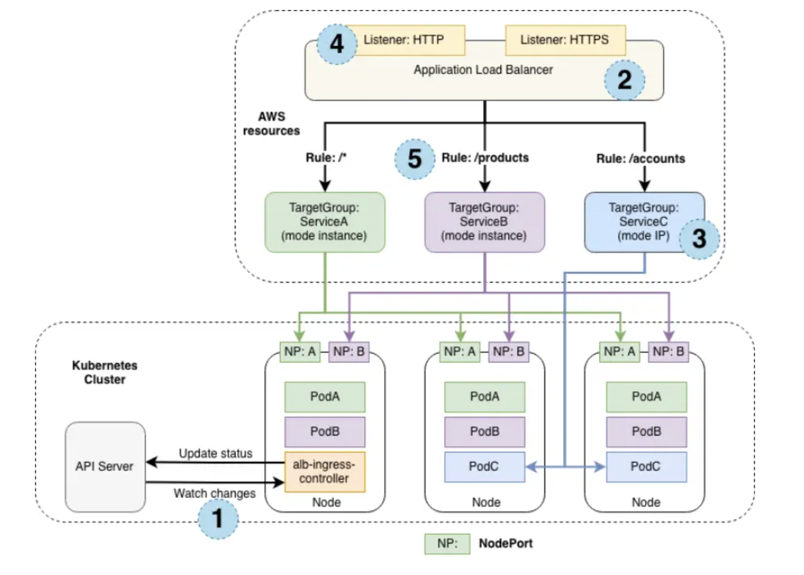

IP mode

As mentioned previously, the NLB we have created is operating in "instance mode". Instance target mode supports pods running on AWS EC2 instances. In this mode, AWS NLB sends traffic to the instances and the kube-proxy on the individual worker nodes forward it to the pods through one or more worker nodes in the Kubernetes cluster.

The AWS Load Balancer Controller also supports creating NLBs operating in "IP mode". In this mode, the AWS NLB sends traffic directly to the Kubernetes pods behind the service, eliminating the need for an extra network hop through the worker nodes in the Kubernetes cluster. IP target mode supports pods running on both AWS EC2 instances and AWS Fargate.

The previous diagram explains how application traffic flows differently when the target group mode is instance and IP.

When the target group mode is instance, the traffic flows via a node port created for a service on each node. In this mode, kube-proxy routes the traffic to the pod running this service. The service pod could be running in a different node than the node that received the traffic from the load balancer. ServiceA (green) and ServiceB (pink) are configured to operate in "instance mode".

Alternatively, when the target group mode is IP, the traffic flows directly to the service pods from the load balancer. In this mode, we bypass a network hop of kube-proxy. ServiceC (blue) is configured to operate in "IP mode".

The numbers in the previous diagram represents the following things.

- The EKS cluster where the services are deployed
- The ELB instance exposing the service
- The target group mode configuration that can be either instance or IP
- The listener protocols configured for the load balancer on which the service is exposed
- The target group rule configuration used to determine the service destination
- There are several reasons why we might want to configure the NLB to operate in IP target mode:

It creates a more efficient network path for inbound connections, bypassing kube-proxy on the EC2 worker node
It removes the need to consider aspects such as externalTrafficPolicy and the trade-offs of its various configuration options
An application is running on Fargate instead of EC2

Re-configuring the NLB:

Let's reconfigure our NLB to use IP mode and look at the effect it has on the infrastructure.

This is the patch we'll be applying to re-configure the Service:

~/environment/eks-workshop/modules/exposing/load-balancer/ip-mode/nlb.yaml

apiVersion: v1
kind: Service
metadata:
  name: ui-nlb
  annotations:
    service.beta.kubernetes.io/aws-load-balancer-nlb-target-type: ip
  namespace: ui

kubectl apply -k ~/environment/eks-workshop/modules/exposing/load-balancer/ip-mode

It will take a few minutes for the configuration of the load balancer to be updated. Run the following command to ensure the annotation is updated:

kubectl describe service/ui-nlb -n ui
Name:                     ui-nlb
Namespace:                ui
Labels:                   <none>
Annotations:              service.beta.kubernetes.io/aws-load-balancer-nlb-target-type: ip
                          service.beta.kubernetes.io/aws-load-balancer-scheme: internet-facing
                          service.beta.kubernetes.io/aws-load-balancer-type: external
Selector:                 app.kubernetes.io/component=service,app.kubernetes.io/instance=ui,app.kubernetes.io/name=ui
Type:                     LoadBalancer
IP Family Policy:         SingleStack
IP Families:              IPv4
IP:                       172.20.31.128
IPs:                      172.20.31.128
LoadBalancer Ingress:     k8s-ui-uinlb-21b5b2e77e-28b54fd6dd7fa4a1.elb.us-west-2.amazonaws.com
Port:                     http  80/TCP
TargetPort:               8080/TCP
NodePort:                 http  31004/TCP
Endpoints:                10.42.145.6:8080
Session Affinity:         None
External Traffic Policy:  Cluster
Internal Traffic Policy:  Cluster
Events:
  Type    Reason                  Age                From     Message
  ----    ------                  ----               ----     -------
  Normal  SuccessfullyReconciled  36s (x2 over 22m)  service  Successfully reconciled

You should be able to access the application using the same URL as before, with the NLB now using IP mode to expose your application.

ALB_ARN=$(aws elbv2 describe-load-balancers --query 'LoadBalancers[?contains(LoadBalancerName, `k8s-ui-uinlb`) == `true`].LoadBalancerArn' | jq -r '.[0]')

TARGET_GROUP_ARN=$(aws elbv2 describe-target-groups --load-balancer-arn $ALB_ARN | jq -r '.TargetGroups[0].TargetGroupArn')

aws elbv2 describe-target-health --target-group-arn $TARGET_GROUP_ARN

{
    "TargetHealthDescriptions": [
        {
            "Target": {
                "Id": "10.42.145.6",
                "Port": 8080,
                "AvailabilityZone": "us-west-2b"
            },
            "HealthCheckPort": "8080",
            "TargetHealth": {
                "State": "healthy"
            },
            "AdministrativeOverride": {
                "State": "no_override",
                "Reason": "AdministrativeOverride.NoOverride",
                "Description": "No override is currently active on target"
            }
        }
    ]
}

Notice that we've gone from the 3 targets we observed in the previous section to just a single target. Why is that? Instead of registering the EC2 instances in our EKS cluster the load balancer controller is now registering individual Pods and sending traffic directly, taking advantage of the AWS VPC CNI and the fact that Pods each have a first-class VPC IP address.

Let's scale up the ui component to 3 replicas see what happens:

kubectl scale -n ui deployment/ui --replicas=3

kubectl wait --for=condition=Ready pod -n ui -l app.kubernetes.io/name=ui --timeout=60s

pod/ui-8564fc5cfb-7vm92 condition met
pod/ui-8564fc5cfb-fp9sh condition met
pod/ui-8564fc5cfb-jqn4d condition met

Now check the load balancer targets again:

ALB_ARN=$(aws elbv2 describe-load-balancers --query 'LoadBalancers[?contains(LoadBalancerName, `k8s-ui-uinlb`) == `true`].LoadBalancerArn' | jq -r '.[0]')

TARGET_GROUP_ARN=$(aws elbv2 describe-target-groups --load-balancer-arn $ALB_ARN | jq -r '.TargetGroups[0].TargetGroupArn')

aws elbv2 describe-target-health --target-group-arn $TARGET_GROUP_ARN

{
    "TargetHealthDescriptions": [
        {
            "Target": {
                "Id": "10.42.145.6",
                "Port": 8080,
                "AvailabilityZone": "us-west-2b"
            },
            "HealthCheckPort": "8080",
            "TargetHealth": {
                "State": "healthy"
            },
            "AdministrativeOverride": {
                "State": "no_override",
                "Reason": "AdministrativeOverride.NoOverride",
                "Description": "No override is currently active on target"
            }
        },
        {
            "Target": {
                "Id": "10.42.186.54",
                "Port": 8080,
                "AvailabilityZone": "us-west-2c"
            },
            "HealthCheckPort": "8080",
            "TargetHealth": {
                "State": "healthy"
            },
            "AdministrativeOverride": {
                "State": "no_override",
                "Reason": "AdministrativeOverride.NoOverride",
                "Description": "No override is currently active on target"
            }
        },
        {
            "Target": {
                "Id": "10.42.123.224",
                "Port": 8080,
                "AvailabilityZone": "us-west-2a"
            },
            "HealthCheckPort": "8080",
            "TargetHealth": {
                "State": "healthy"
            },
            "AdministrativeOverride": {
                "State": "no_override",
                "Reason": "AdministrativeOverride.NoOverride",
                "Description": "No override is currently active on target"
            }
        }
    ]
}

As expected we now have 3 targets, matching the number of replicas in the ui Deployment.

If you want to wait to make sure the application still functions the same, run the following command. Otherwise you can proceed to the next module.

wait-for-lb $(kubectl get service -n ui ui-nlb -o jsonpath="{.status.loadBalancer.ingress[*].hostname}{'\n'}")

