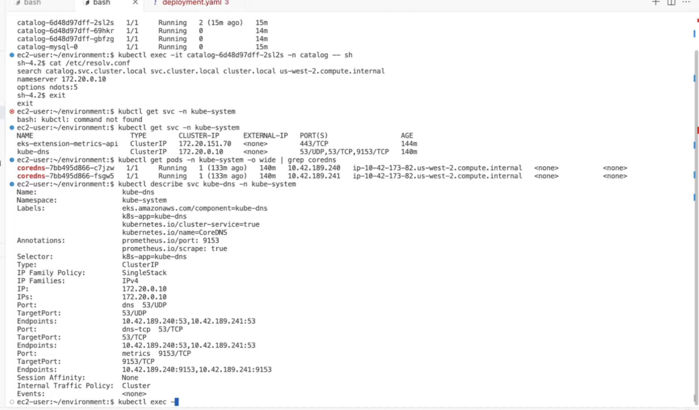
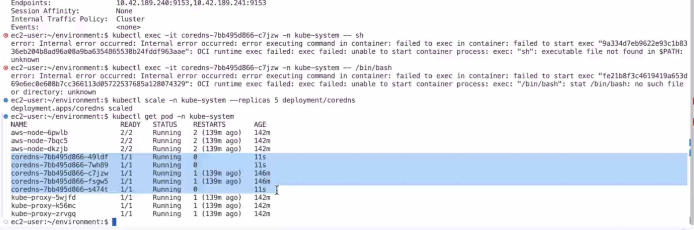
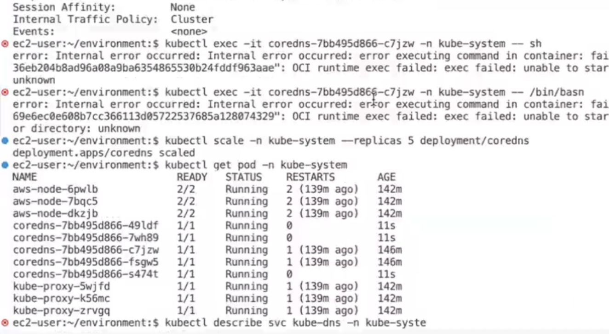
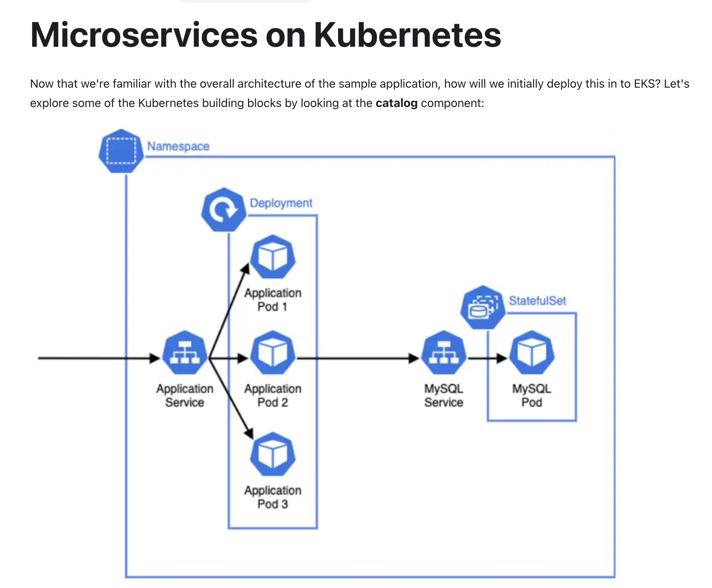
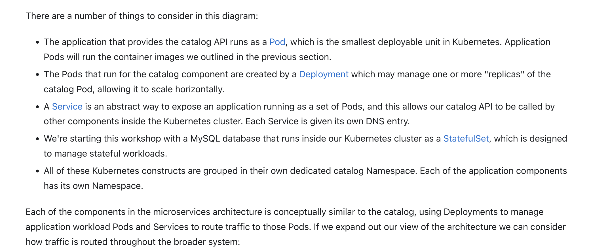
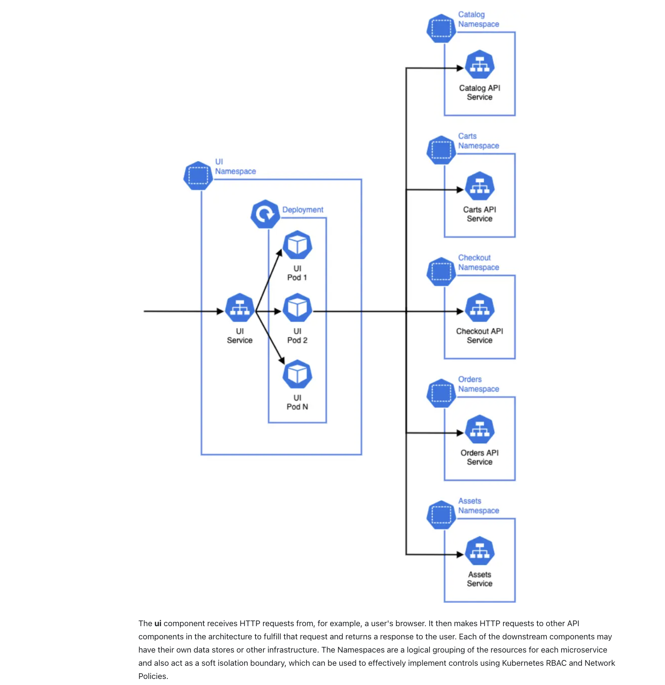
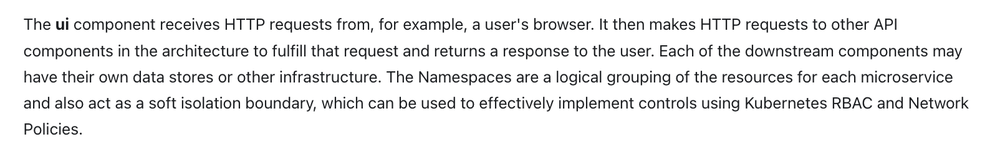
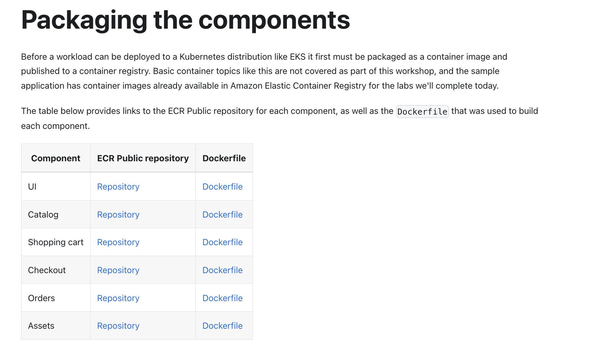
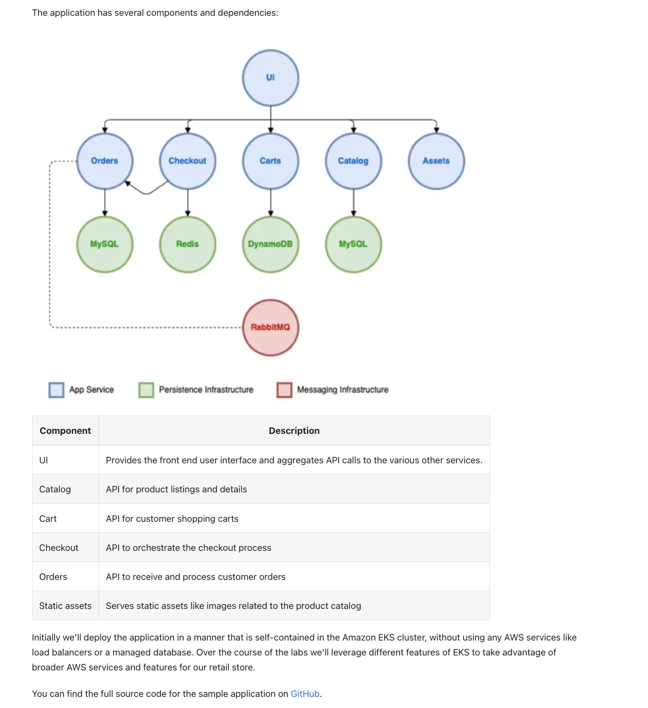
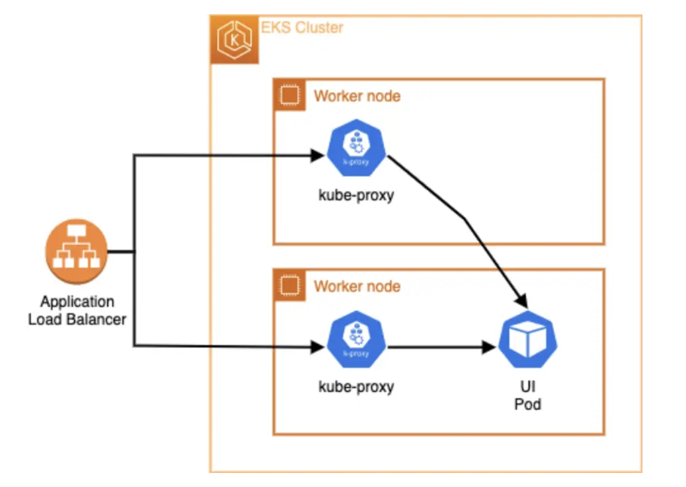

eksctl installation:

https://eksctl.io/installation/

Github link:

https://github.com/aws-containers/retail-store-sample-app

Expose the sample application so we can access it over the public Internet
Configure the worker nodes within the managed node group that power the EKS cluster
Enable and re-deploy an application using Fargate
Configure EBS, EFS and FSxN for stateful application

Right now our web store application is not exposed to the outside world, so there's no way for users to access it. Although there are many microservices in our web store workload, only the ui application needs to be available to end users. This is because the ui application will perform all communication to the other backend services using internal Kubernetes networking.

AWS Load Balancer Controller is a controller to help manage Elastic Load Balancers for a Kubernetes cluster.

The controller can provision the following resources:

An AWS Application Load Balancer when you create a Kubernetes Ingress.
An AWS Network Load Balancer when you create a Kubernetes Service of type LoadBalancer.
Application Load Balancers work at L7 of the OSI model, allowing you to expose Kubernetes service using ingress rules, and supports external-facing traffic. Network load balancers work at L4 of the OSI model, allowing you to leverage Kubernetes Services to expose a set of pods as an application network service.

The controller enables you to simplify operations and save costs by sharing an Application Load Balancer across multiple applications in your Kubernetes cluster.

Kubernetes uses services to expose pods outside of a cluster. One of the most popular ways to use services in AWS is with the LoadBalancer type. With a simple YAML file declaring your service name, port, and label selector, the cloud controller will provision a load balancer for you automatically.

apiVersion: v1
kind: Service
metadata:
  name: search-svc # the name of our service
spec:
  type: loadBalancer
  selector:
    app: SearchApp # pods are deployed with the label app=SearchApp
  ports:
    - port: 80

This is great because of how simple it is to put a load balancer in front of your application. The service spec has been extended over the years with annotations and additional configuration. A second option is to use an ingress rule and an ingress controller to route external traffic into Kubernetes pods.

helm repo add eks-charts https://aws.github.io/eks-charts

helm upgrade --install aws-load-balancer-controller eks-charts/aws-load-balancer-controller \
  --version "${LBC_CHART_VERSION}" \
  --namespace "kube-system" \
  --set "clusterName=${EKS_CLUSTER_NAME}" \
  --set "serviceAccount.name=aws-load-balancer-controller-sa" \
  --set "serviceAccount.annotations.eks\\.amazonaws\\.com/role-arn"="$LBC_ROLE_ARN" \
  --wait

kubectl get svc -l app.kubernetes.io/created-by=eks-workshop -A

kubectl -n ui describe service ui

Creating load balancer:

apiVersion: v1
kind: Service
metadata:
  name: ui-nlb
  annotations:
    service.beta.kubernetes.io/aws-load-balancer-type: external
    service.beta.kubernetes.io/aws-load-balancer-scheme: internet-facing
    service.beta.kubernetes.io/aws-load-balancer-nlb-target-type: instance
  namespace: ui
spec:
  type: LoadBalancer
  ports:
    - port: 80
      targetPort: 8080
      name: http
  selector:
    app.kubernetes.io/name: ui
    app.kubernetes.io/instance: ui
    app.kubernetes.io/component: service

This Service will create a Network Load Balancer

The NLB will listens on port 80 and forwards connections to the ui Pods on port 8080

Here we express which pods should be added as target for this service using labels on the pods

kubectl apply -k ~/environment/eks-workshop/modules/exposing/load-balancer/nlb

kubectl get service -n ui

NAME     TYPE           CLUSTER-IP       EXTERNAL-IP                                                            PORT(S)        AGE
ui       ClusterIP      172.20.192.220   <none>                                                                 80/TCP         43m
ui-nlb   LoadBalancer   172.20.31.128    k8s-ui-uinlb-21b5b2e77e-28b54fd6dd7fa4a1.elb.us-west-2.amazonaws.com   80:31004/TCP   18s

The NLB will take several minutes to provision and register its targets so take some time to inspect the load balancer resources the controller has created.

First, take a look at the load balancer itself:

aws elbv2 describe-load-balancers --query 'LoadBalancers[?contains(LoadBalancerName, `k8s-ui-uinlb`) == `true`]'
[
    {
        "LoadBalancerArn": "arn:aws:elasticloadbalancing:us-west-2:085127928691:loadbalancer/net/k8s-ui-uinlb-21b5b2e77e/28b54fd6dd7fa4a1",
        "DNSName": "k8s-ui-uinlb-21b5b2e77e-28b54fd6dd7fa4a1.elb.us-west-2.amazonaws.com",
        "CanonicalHostedZoneId": "Z18D5FSROUN65G",
        "CreatedTime": "2025-02-18T10:34:12.308000+00:00",
        "LoadBalancerName": "k8s-ui-uinlb-21b5b2e77e",
        "Scheme": "internet-facing",
        "VpcId": "vpc-090a1bdc1973b2346",
        "State": {
            "Code": "provisioning"
        },
        "Type": "network",
        "AvailabilityZones": [
            {
                "ZoneName": "us-west-2c",
                "SubnetId": "subnet-0802b1584908be431",
                "LoadBalancerAddresses": []
            },
            {
                "ZoneName": "us-west-2a",
                "SubnetId": "subnet-04cca48477142c169",
                "LoadBalancerAddresses": []
            },
            {
                "ZoneName": "us-west-2b",
                "SubnetId": "subnet-08252b7e756d03f3a",
                "LoadBalancerAddresses": []
            }
        ],
        "SecurityGroups": [
            "sg-002f6f96f2c66085c",
            "sg-0ae546a958d4053ce"
        ],
        "IpAddressType": "ipv4",
        "EnablePrefixForIpv6SourceNat": "off"
    }
]

What does this tell us?

The NLB is accessible over the public internet
It uses the public subnets in our VPC

We can also inspect the targets in the target group that was created by the controller:

ALB_ARN=$(aws elbv2 describe-load-balancers --query 'LoadBalancers[?contains(LoadBalancerName, `k8s-ui-uinlb`) == `true`].LoadBalancerArn' | jq -r '.[0]')

TARGET_GROUP_ARN=$(aws elbv2 describe-target-groups --load-balancer-arn $ALB_ARN | jq -r '.TargetGroups[0].TargetGroupArn')

aws elbv2 describe-target-health --target-group-arn $TARGET_GROUP_ARN

{
    "TargetHealthDescriptions": [
        {
            "Target": {
                "Id": "i-0cc9957b18802923c",
                "Port": 31004
            },
            "HealthCheckPort": "31004",
            "TargetHealth": {
                "State": "healthy"
            },
            "AdministrativeOverride": {
                "State": "no_override",
                "Reason": "AdministrativeOverride.NoOverride",
                "Description": "No override is currently active on target"
            }
        },
        {
            "Target": {
                "Id": "i-0b250246e47fb62b4",
                "Port": 31004
            },
            "HealthCheckPort": "31004",
            "TargetHealth": {
                "State": "healthy"
            },
            "AdministrativeOverride": {
                "State": "no_override",
                "Reason": "AdministrativeOverride.NoOverride",
                "Description": "No override is currently active on target"
            }
        },
        {
            "Target": {
                "Id": "i-08c53652f00f12007",
                "Port": 31004
            },
            "HealthCheckPort": "31004",
            "TargetHealth": {
                "State": "healthy"
            },
            "AdministrativeOverride": {
                "State": "no_override",
                "Reason": "AdministrativeOverride.NoOverride",
                "Description": "No override is currently active on target"
            }
        }
    ]
}

The output above shows that we have 3 targets registered to the load balancer using the EC2 instance IDs (i-) each on the same port. The reason for this is that by default the AWS Load Balancer Controller operates in "instance mode", which targets traffic to the worker nodes in the EKS cluster and allows kube-proxy to forward traffic to individual Pods.

Get the URL from the Service resource:

kubectl get service -n ui ui-nlb -o jsonpath="{.status.loadBalancer.ingress[*].hostname}{'\n'}"

k8s-ui-uinlb-21b5b2e77e-28b54fd6dd7fa4a1.elb.us-west-2.amazonaws.com

To wait until the load balancer has finished provisioning you can run this command:

wait-for-lb $(kubectl get service -n ui ui-nlb -o jsonpath="{.status.loadBalancer.ingress[*].hostname}{'\n'}")

