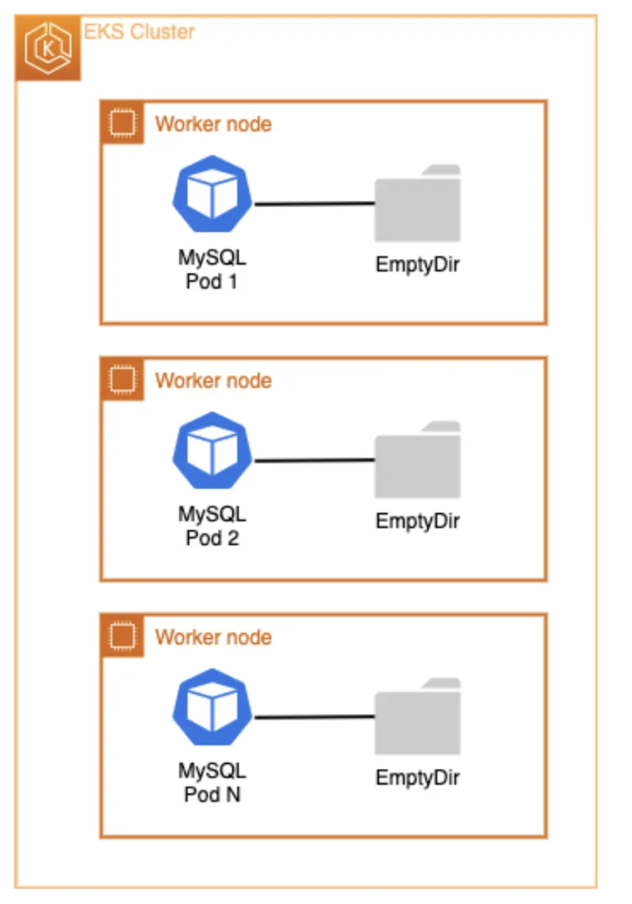
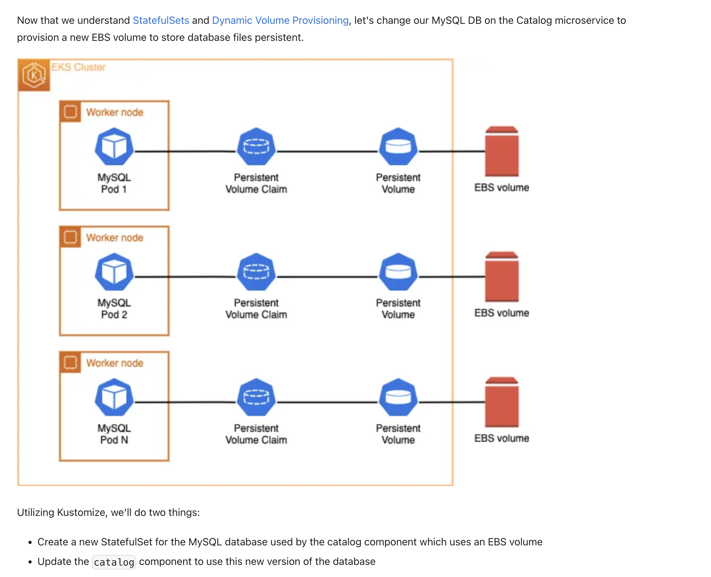

Amazon EBS

Amazon Elastic Block Store is an easy-to-use, scalable, high-performance block-storage service. It provides persistent volume (non-volatile storage) to users. Persistent storage enables users to store their data until they decide to delete the data.

In this lab, we'll learn about the following concepts:

Kubernetes StatefulSets
EBS CSI Driver
StatefulSet with EBS Volume

StatefulSets:

Like Deployments, StatefulSets manage Pods that are based on an identical container spec. Unlike Deployments, StatefulSets maintain a sticky identity for each of its Pods. These Pods are created from the same spec, but are not interchangeable with each having a persistent identifier that it maintains across any rescheduling event.

If you want to use storage volumes to provide persistence for your workload, you can use a StatefulSet as part of the solution. Although individual Pods in a StatefulSet are susceptible to failure, the persistent Pod identifiers make it easier to match existing volumes to the new Pods that replace any that have failed.

StatefulSets are valuable for applications that require one or more of the following:

Stable, unique network identifiers
Stable, persistent storage
Ordered, graceful deployment and scaling
Ordered, automated rolling updates

In our ecommerce application, we have a StatefulSet already deployed as part of the Catalog microservice. The Catalog microservice utilizes a MySQL database running on EKS. Databases are a great example for the use of StatefulSets because they require persistent storage. We can analyze our MySQL Database Pod to see its current volume configuration:

An emptyDir volume is first created when a Pod is assigned to a node, and exists as long as that Pod is running on that node. As the name implies, the emptyDir volume is initially empty. All containers in the Pod can read and write the same files in the emptyDir volume, though that volume can be mounted on the same or different paths in each container. When a Pod is removed from a node for any reason, the data in the emptyDir is deleted permanently. Therefore EmptyDir is not a good fit for our MySQL Database.

We can demonstrate this by starting a shell session inside the MySQL container and creating a test file. After that we'll delete the Pod that is running in our StatefulSet. Because the pod is using an emptyDir and not a Persistent Volume (PV), the file will not survive a Pod restart. First let's run a command inside our MySQL container to create a file in the emptyDir /var/lib/mysql path (where MySQL saves database files):

kubectl exec catalog-mysql-0 -n catalog -- bash -c  "echo 123 > /var/lib/mysql/test.txt"

Now, let's verify our test.txt file was created in the /var/lib/mysql directory:

kubectl exec catalog-mysql-0 -n catalog -- ls -larth /var/lib/mysql/ | grep -i test

Now, let's remove the current catalog-mysql Pod. This will force the StatefulSet controller to automatically re-create a new catalog-mysql Pod:

kubectl delete pods -n catalog -l app.kubernetes.io/component=mysql

Wait for a few seconds and run the command below to check if the catalog-mysql Pod has been re-created:

kubectl wait --for=condition=Ready pod -n catalog \
  -l app.kubernetes.io/component=mysql --timeout=30s

  kubectl get pods -n catalog -l app.kubernetes.io/component=mysql
NAME              READY   STATUS    RESTARTS   AGE
catalog-mysql-0   1/1     Running   0          59s

Finally, let's exec back into the MySQL container shell and run a ls command in the /var/lib/mysql path to look for the test.txt file that was previously created:

kubectl exec catalog-mysql-0 -n catalog -- cat /var/lib/mysql/test.txt
cat: /var/lib/mysql/test.txt: No such file or directory
command terminated with exit code 1

As you can see the test.txt file no longer exists due to emptyDir volumes being ephemeral. In future sections, we'll run the same experiment and demostrate how Persistent Volumes (PVs) will persist the test.txt file and survive Pod restarts and/or failures.

EBS CSI Driver:

The Kubernetes Container Storage Interface (CSI)- https://kubernetes-csi.github.io/docs/- helps you run stateful containerized applications. CSI drivers provide a CSI interface that allows Kubernetes clusters to manage the lifecycle of persistent volumes. Amazon EKS makes it easier for you to run stateful workloads by offering CSI drivers for Amazon EBS.

In order to utilize Amazon EBS volumes with dynamic provisioning on our EKS cluster, we need to confirm that we have the EBS CSI Driver installed. The Amazon Elastic Block Store (Amazon EBS) Container Storage Interface (CSI) driver allows Amazon Elastic Kubernetes Service (Amazon EKS) clusters to manage the lifecycle of Amazon EBS volumes for persistent volumes.

To improve security and reduce the amount of work, you can manage the Amazon EBS CSI driver as an Amazon EKS add-on. The IAM role needed by the addon was created for us so we can go ahead and install the addon:

aws eks create-addon --cluster-name $EKS_CLUSTER_NAME --addon-name aws-ebs-csi-driver \
  --service-account-role-arn $EBS_CSI_ADDON_ROLE \
  --configuration-values '{"defaultStorageClass":{"enabled":true}}'

  {
    "addon": {
        "addonName": "aws-ebs-csi-driver",
        "clusterName": "eks-workshop",
        "status": "CREATING",
        "addonVersion": "v1.39.0-eksbuild.1",
        "health": {
            "issues": []
        },
        "addonArn": "arn:aws:eks:us-west-2:085127928691:addon/eks-workshop/aws-ebs-csi-driver/94ca8c8d-59cd-6ab2-40dc-8c350b42297b",
        "createdAt": "2025-02-18T12:48:55.335000+00:00",
        "modifiedAt": "2025-02-18T12:48:55.352000+00:00",
        "serviceAccountRoleArn": "arn:aws:iam::085127928691:role/eks-workshop-ebs-csi-20250218121211048600000001",
        "tags": {},
        "configurationValues": "{\"defaultStorageClass\":{\"enabled\":true}}"
    }
}

aws eks wait addon-active --cluster-name $EKS_CLUSTER_NAME --addon-name aws-ebs-csi-driver

Now we can take a look at what has been created in our EKS cluster by the addon. For example, a DaemonSet will be running a pod on each node in our cluster:

kubectl get daemonset ebs-csi-node -n kube-system

NAME           DESIRED   CURRENT   READY   UP-TO-DATE   AVAILABLE   NODE SELECTOR            AGE
ebs-csi-node   3         3         3       3            3           kubernetes.io/os=linux   3d21h

Starting with EKS 1.30, the EBS CSI Driver use a default StorageClass object configured using Amazon EBS GP3 volume type. Run the following command to confirm:

kubectl get storageclass
NAME                           PROVISIONER             RECLAIMPOLICY   VOLUMEBINDINGMODE      ALLOWVOLUMEEXPANSION   AGE
ebs-csi-default-sc (default)   ebs.csi.aws.com         Delete          WaitForFirstConsumer   true                   96s
gp2                            kubernetes.io/aws-ebs   Delete          WaitForFirstConsumer   false 

Now that we have a better understanding of EKS Storage and Kubernetes objects.
we'll focus on modifying the MySQL DB StatefulSet of the catalog microservice to utilize a EBS block store volume as the persistent storage for the database files using Kubernetes dynamic volume provisioning.

StatefulSet with EBS Volume:

Here in the new catalog database StatefulSet:

~/environment/eks-workshop/modules/fundamentals/storage/ebs/statefulset-mysql.yaml

apiVersion: apps/v1
kind: StatefulSet
metadata:
  name: catalog-mysql-ebs
  namespace: catalog
  labels:
    app.kubernetes.io/created-by: eks-workshop
    app.kubernetes.io/team: database
spec:
  replicas: 1
  selector:
    matchLabels:
      app.kubernetes.io/name: catalog
      app.kubernetes.io/instance: catalog
      app.kubernetes.io/component: mysql-ebs
  serviceName: mysql
  template:
    metadata:
      labels:
        app.kubernetes.io/name: catalog
        app.kubernetes.io/instance: catalog
        app.kubernetes.io/component: mysql-ebs
        app.kubernetes.io/created-by: eks-workshop
        app.kubernetes.io/team: database
    spec:
      containers:
        - name: mysql
          image: "public.ecr.aws/docker/library/mysql:8.0"
          imagePullPolicy: IfNotPresent
          env:
            - name: MYSQL_ROOT_PASSWORD
              value: my-secret-pw
            - name: MYSQL_USER
              valueFrom:
                secretKeyRef:
                  name: catalog-db
                  key: username
            - name: MYSQL_PASSWORD
              valueFrom:
                secretKeyRef:
                  name: catalog-db
                  key: password
            - name: MYSQL_DATABASE
              value: catalog
          ports:
            - name: mysql
              containerPort: 3306
              protocol: TCP
          volumeMounts:
            - name: data
              mountPath: /var/lib/mysql
  volumeClaimTemplates:
    - metadata:
        name: data
      spec:
        accessModes: ["ReadWriteOnce"]
        storageClassName: ebs-csi-default-sc
        resources:
          requests:
            storage: 30Gi

Notice the volumeClaimTemplates field which specifies the instructs Kubernetes to utilize Dynamic Volume Provisioning to create a new EBS Volume, a PersistentVolume (PV) and a PersistentVolumeClaim (PVC) all automatically.

Apply the changes and wait for the new Pods to be rolled out:

kubectl apply -k ~/environment/eks-workshop/modules/fundamentals/storage/ebs/
kubectl rollout status --timeout=100s statefulset/catalog-mysql-ebs -n catalog

Let's now confirm that our newly deployed StatefulSet is running:

kubectl get statefulset -n catalog catalog-mysql-ebs
NAME                READY   AGE
catalog-mysql-ebs   1/1     79s

Inspecting our catalog-mysql-ebs StatefulSet, we can see that now we have a PersistentVolumeClaim attached to it with 30GiB and with storageClassName of ebs-csi-driver.

kubectl get statefulset -n catalog catalog-mysql-ebs \
  -o jsonpath='{.spec.volumeClaimTemplates}' | jq .

[
  {
    "apiVersion": "v1",
    "kind": "PersistentVolumeClaim",
    "metadata": {
      "creationTimestamp": null,
      "name": "data"
    },
    "spec": {
      "accessModes": [
        "ReadWriteOnce"
      ],
      "resources": {
        "requests": {
          "storage": "30Gi"
        }
      },
      "storageClassName": "ebs-csi-default-sc",
      "volumeMode": "Filesystem"
    },
    "status": {
      "phase": "Pending"
    }
  }
]  

We can analyze how the Dynamic Volume Provisioning created a PersistentVolume (PV) automatically for us:

kubectl get pv | grep -i catalog
pvc-0f36275c-58b4-4cf2-8d22-75aa9d45b948   30Gi       RWO            Delete           Bound    catalog/data-catalog-mysql-ebs-0   ebs-csi-default-sc   <unset>                          2m12s

Utilizing the AWS CLI, we can check the Amazon EBS volume that got created automatically for us:

[
    {
        "ID": "vol-0cf89a35eae96057c",
        "Tag": [
            {
                "Key": "Name",
                "Value": "eks-workshop-dynamic-pvc-0f36275c-58b4-4cf2-8d22-75aa9d45b948"
            },
            {
                "Key": "KubernetesCluster",
                "Value": "eks-workshop"
            },
            {
                "Key": "kubernetes.io/created-for/pvc/namespace",
                "Value": "catalog"
            },
            {
                "Key": "CSIVolumeName",
                "Value": "pvc-0f36275c-58b4-4cf2-8d22-75aa9d45b948"
            },
            {
                "Key": "kubernetes.io/created-for/pv/name",
                "Value": "pvc-0f36275c-58b4-4cf2-8d22-75aa9d45b948"
            },
            {
                "Key": "kubernetes.io/cluster/eks-workshop",
                "Value": "owned"
            },
            {
                "Key": "kubernetes.io/created-for/pvc/name",
                "Value": "data-catalog-mysql-ebs-0"
            },
            {
                "Key": "ebs.csi.aws.com/cluster",
                "Value": "true"
            }
        ]
    }
]
If you'd like to inspect the container shell and check out the newly EBS volume attached to the Linux OS, run this instructions to run a shell command into the catalog-mysql-ebs container. It'll inspect the file-systems that you have mounted:

kubectl exec --stdin catalog-mysql-ebs-0  -n catalog -- bash -c "df -h"
Filesystem      Size  Used Avail Use% Mounted on
overlay          80G  6.5G   74G   9% /
tmpfs            64M     0   64M   0% /dev
/dev/nvme0n1p1   80G  6.5G   74G   9% /etc/hosts
shm              64M     0   64M   0% /dev/shm
/dev/nvme1n1     30G  202M   30G   1% /var/lib/mysql ---
tmpfs           7.0G   12K  7.0G   1% /run/secrets/kubernetes.io/serviceaccount
tmpfs           3.9G     0  3.9G   0% /proc/acpi
tmpfs           3.9G     0  3.9G   0% /sys/firmware

Check the disk that is currently being mounted on the /var/lib/mysql. This is the EBS Volume for the stateful MySQL database files that being stored in a persistent way.

Let's now test if our data is in fact persistent. We'll create the same test.txt file exactly the same way as we did on the first section of this module:

kubectl exec catalog-mysql-ebs-0 -n catalog -- bash -c  "echo 123 > /var/lib/mysql/test.txt"

Now, let's verify that our test.txt file got created on the /var/lib/mysql directory:

kubectl exec catalog-mysql-ebs-0 -n catalog -- ls -larth /var/lib/mysql/ | grep -i test

~kubectl exec catalog-mysql-ebs-0 -n catalog -- ls -larth /var/lib/mysql/ | grep -i test
-rw-r--r--. 1 root  root     4 Feb 18 13:27 test.txt

Now, let's remove the current catalog-mysql-ebs Pod, which will force the StatefulSet controller to automatically re-create it:

kubectl delete pods -n catalog catalog-mysql-ebs-0

Wait for a few seconds, and run the command below to check if the catalog-mysql-ebs Pod has been re-created:

kubectl wait --for=condition=Ready pod -n catalog \
  -l app.kubernetes.io/component=mysql-ebs --timeout=60s

kubectl get pods -n catalog -l app.kubernetes.io/component=mysql-ebs
NAME                  READY   STATUS    RESTARTS   AGE
catalog-mysql-ebs-0   1/1     Running   0          37s

Finally, let's exec back into the MySQL container shell and run a ls command on the /var/lib/mysql path trying to look for the test.txt file that we created, and see if the file has now persisted:

kubectl exec catalog-mysql-ebs-0 -n catalog -- ls -larth /var/lib/mysql/ | grep -i test
kubectl exec catalog-mysql-ebs-0 -n catalog -- cat /var/lib/mysql/test.txt

ec2-user:~/environment:$ kubectl exec catalog-mysql-ebs-0 -n catalog -- ls -larth /var/lib/mysql/ | grep -i test
kubectl exec catalog-mysql-ebs-0 -n catalog -- cat /var/lib/mysql/test.txt
-rw-r--r--. 1 mysql root     4 Feb 18 13:27 test.txt
123
ec2-user:~/environment:$ kubectl exec catalog-mysql-ebs-0 -n catalog -- cat /var/lib/mysql/test.txt
123

As you can see the test.txt file is still available after a Pod delete and restart and with the right text on it 123. This is the main functionality of Persistent Volumes (PVs). Amazon EBS is storing the data and keeping our data safe and available within an AWS availability zone.

------------------
In Kubernetes, a "service account" is a unique identity used by applications running within a cluster to access the Kubernetes API, while a "role" defines a set of permissions that can be assigned to a service account (or a user) to control what actions it can perform on cluster resources; essentially, a service account is the identity, and a role defines what that identity is allowed to do. 
 
So when it comes to AWS, you use IRSA, IAM role for service account not the native kubenetes role 

--------------------
API Gateway===> ALB==> Service===> POD

 