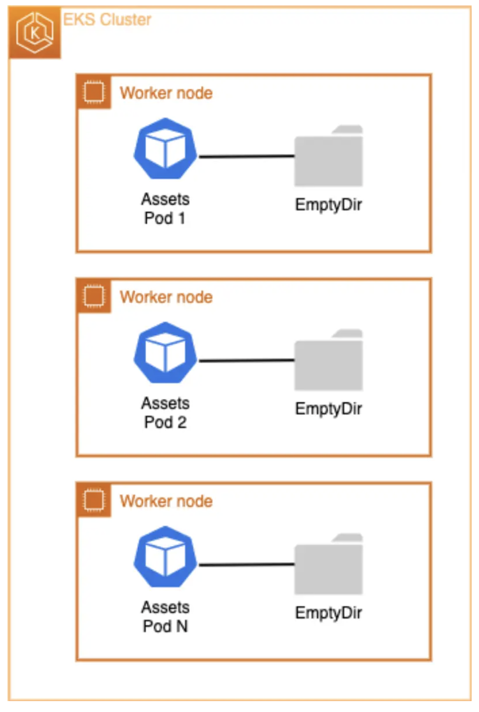
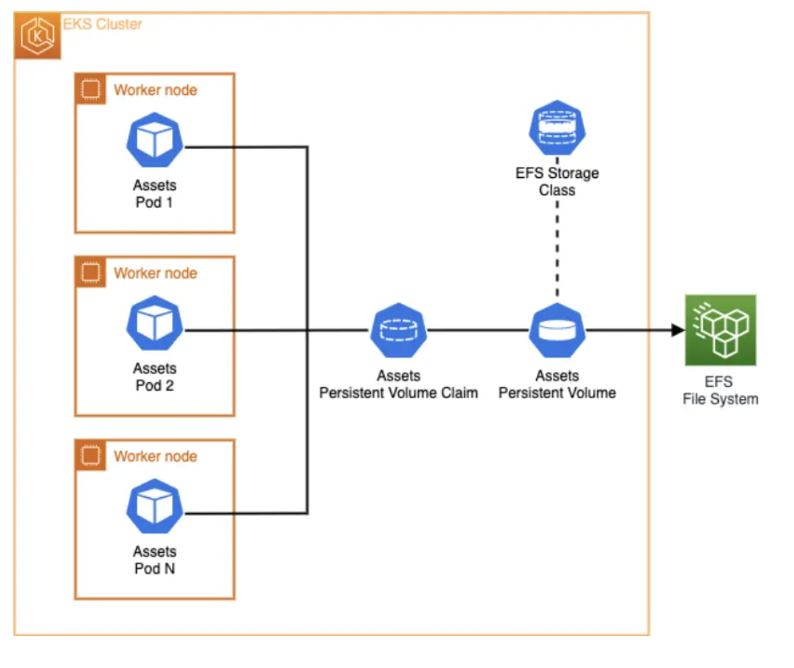

Amazon Elastic File System (Amazon EFS) provides a serverless, fully elastic file system that automatically scales on demand to petabytes without disrupting applications. It eliminates the need to provision and manage capacity as you add and remove files, making it ideal for use with AWS Cloud services and on-premises resources.

https://docs.aws.amazon.com/efs/latest/ug/whatisefs.html

In this lab, you will:

Learn about persistent network storage with the assets microservice
Configure and deploy the EFS CSI Driver for Kubernetes
Implement dynamic provisioning using EFS in a Kubernetes deployment

Persistent network storage
Our ecommerce application includes a deployment for the assets microservice, which runs a webserver on EKS. Web servers are an excellent use case for deployments as they can scale horizontally and declare the new state of the Pods.

The assets component serves static product images that are currently bundled into the container image during build time. This means that whenever the team needs to update product images, they must rebuild and redeploy the container image. In this exercise, we'll use Amazon EFS File System and Kubernetes Persistent Volume to enable updating existing product images and adding new ones without rebuilding container images.

kubectl describe deployment -n assets
Name:                   assets
Namespace:              assets
CreationTimestamp:      Tue, 18 Feb 2025 09:51:24 +0000
Labels:                 app.kubernetes.io/created-by=eks-workshop
                        app.kubernetes.io/type=app
Annotations:            deployment.kubernetes.io/revision: 1
Selector:               app.kubernetes.io/component=service,app.kubernetes.io/instance=assets,app.kubernetes.io/name=assets
Replicas:               1 desired | 1 updated | 1 total | 1 available | 0 unavailable
StrategyType:           RollingUpdate
MinReadySeconds:        0
RollingUpdateStrategy:  25% max unavailable, 25% max surge
Pod Template:
  Labels:           app.kubernetes.io/component=service
                    app.kubernetes.io/created-by=eks-workshop
                    app.kubernetes.io/instance=assets
                    app.kubernetes.io/name=assets
  Annotations:      prometheus.io/path: /metrics
                    prometheus.io/port: 8080
                    prometheus.io/scrape: true
  Service Account:  assets
  Containers:
   assets:
    Image:      public.ecr.aws/aws-containers/retail-store-sample-assets:0.4.0
    Port:       8080/TCP
    Host Port:  0/TCP
    Limits:
      memory:  128Mi
    Requests:
      cpu:     128m
      memory:  128Mi
    Liveness:  http-get http://:8080/health.html delay=0s timeout=1s period=3s #success=1 #failure=3
    Environment Variables from:
      assets      ConfigMap  Optional: false
    Environment:  <none>
    Mounts:
      /tmp from tmp-volume (rw)
  Volumes:
   tmp-volume:
    Type:          EmptyDir (a temporary directory that shares a pod's lifetime)
    Medium:        Memory
    SizeLimit:     <unset>
  Node-Selectors:  <none>
  Tolerations:     <none>
Conditions:
  Type           Status  Reason
  ----           ------  ------
  Progressing    True    NewReplicaSetAvailable
  Available      True    MinimumReplicasAvailable
OldReplicaSets:  <none>
NewReplicaSet:   assets-69974886bf (1/1 replicas created)
Events:          <none>

The Volumes section shows we're only using an EmptyDir volume type which is tied to the Pod's lifetime.

An emptyDir volume is created when a Pod is assigned to a node and exists only while that Pod runs on that node. As the name suggests, the emptyDir volume is initially empty. While all containers in the Pod can read and write files in the emptyDir volume, when a Pod is removed from a node for any reason, the data in the emptyDir is deleted permanently. This makes EmptyDir unsuitable for sharing data between multiple Pods in the same Deployment when that data needs to be modified.

The container includes some initial product images copied during the build process to /usr/share/nginx/html/assets. We can verify this with:

kubectl exec --stdin deployment/assets \
  -n assets -- bash -c "ls /usr/share/nginx/html/assets/"
chrono_classic.jpg
gentleman.jpg
pocket_watch.jpg
smart_1.jpg
smart_2.jpg
wood_watch.jpg

Let's scale up the assets Deployment to multiple replicas:

kubectl scale -n assets --replicas=2 deployment/assets
kubectl rollout status -n assets deployment/assets --timeout=60s

Now let's try creating a new product image file newproduct.png in the /usr/share/nginx/html/assets directory of the first Pod:

POD_NAME=$(kubectl -n assets get pods -o jsonpath='{.items[0].metadata.name}')

kubectl exec --stdin $POD_NAME \
  -n assets -- bash -c 'touch /usr/share/nginx/html/assets/newproduct.png'

Let's verify if the new product image newproduct.png exists in the second Pod's file system:

POD_NAME=$(kubectl -n assets get pods -o jsonpath='{.items[1].metadata.name}')

kubectl exec --stdin $POD_NAME \
  -n assets -- bash -c 'ls /usr/share/nginx/html/assets'

As we can see, the newly created image newproduct.png doesn't exist on the second Pod. To address this limitation, we need a file system that can be shared across multiple Pods when the service scales horizontally while allowing file updates without redeployment.

EFS CSI Driver:

Before diving into this section, you should be familiar with the Kubernetes storage objects (volumes, persistent volumes (PV), persistent volume claims (PVC), dynamic provisioning and ephemeral storage) that were introduced in the Storage main section.

The Amazon Elastic File System Container Storage Interface (CSI) Driver enables you to run stateful containerized applications by providing a CSI interface that allows Kubernetes clusters running on AWS to manage the lifecycle of Amazon EFS file systems.

To utilize Amazon EFS with dynamic provisioning on our EKS cluster, we first need to confirm that we have the EFS CSI Driver installed. The driver implements the CSI specification which allows container orchestrators to manage Amazon EFS file systems throughout their lifecycle.

For improved security and simplified management, you can run the Amazon EFS CSI driver as an Amazon EKS add-on. Since the required IAM role has already been created for us, we can proceed with installing the add-on:

aws eks create-addon --cluster-name $EKS_CLUSTER_NAME --addon-name aws-efs-csi-driver \
  --service-account-role-arn $EFS_CSI_ADDON_ROLE

{
    "addon": {
        "addonName": "aws-efs-csi-driver",
        "clusterName": "eks-workshop",
        "status": "CREATING",
        "addonVersion": "v2.1.4-eksbuild.1",
        "health": {
            "issues": []
        },
        "addonArn": "arn:aws:eks:us-west-2:085127928691:addon/eks-workshop/aws-efs-csi-driver/deca90f2-f81b-69fb-ed9d-5d1d8669d462",
        "createdAt": "2025-02-20T05:47:52.610000+00:00",
        "modifiedAt": "2025-02-20T05:47:52.623000+00:00",
        "serviceAccountRoleArn": "arn:aws:iam::085127928691:role/eks-workshop-efs-csi-20250220052247266300000002",
        "tags": {}
    }
}

aws eks wait addon-active --cluster-name $EKS_CLUSTER_NAME --addon-name aws-efs-csi-driver

Let's examine what the add-on has created in our EKS cluster. For example, a DaemonSet that runs a pod on each node in our cluster:

kubectl get daemonset efs-csi-node -n kube-system
NAME           DESIRED   CURRENT   READY   UP-TO-DATE   AVAILABLE   NODE SELECTOR            AGE
efs-csi-node   3         3         3       3            3           kubernetes.io/os=linux   44s

The EFS CSI driver supports both dynamic and static provisioning. For dynamic provisioning, the driver creates an access point for each PersistentVolume, but requires an existing AWS EFS file system that must be specified in the StorageClass parameters. Static provisioning also requires a pre-created AWS EFS file system, which can then be mounted as a volume inside a container using the driver.

An EFS file system has been provisioned for us, along with mount targets and the required security group that includes an inbound rule allowing NFS traffic to the EFS mount points. Let's get its ID which we'll need later:

export EFS_ID=$(aws efs describe-file-systems --query "FileSystems[?Name=='$EKS_CLUSTER_NAME-efs-assets'] | [0].FileSystemId" --output text)
ec2-user:~/environment:$ echo $EFS_ID

Next, we'll create a StorageClass object configured to use our pre-provisioned EFS file system and EFS Access points in provisioning mode.

Using Kustomize, we'll create the storage class and inject the EFS_ID environment variable into the filesystemid parameter:

~/environment/eks-workshop/modules/fundamentals/storage/efs/storageclass/efsstorageclass.yaml

kind: StorageClass
apiVersion: storage.k8s.io/v1
metadata:
  name: efs-sc
provisioner: efs.csi.aws.com
parameters:
  provisioningMode: efs-ap
  fileSystemId: ${EFS_ID}
  directoryPerms: "700"

Apply the kustomization:

kubectl kustomize ~/environment/eks-workshop/modules/fundamentals/storage/efs/storageclass \
  | envsubst | kubectl apply -f-
storageclass.storage.k8s.io/efs-sc created

Let's examine the StorageClass. Note that it uses the EFS CSI driver as the provisioner and is configured for EFS access point provisioning mode with the file system ID we exported earlier:

kubectl get storageclass
NAME     PROVISIONER             RECLAIMPOLICY   VOLUMEBINDINGMODE      ALLOWVOLUMEEXPANSION   AGE
efs-sc   efs.csi.aws.com         Delete          Immediate              false                  29s
gp2      kubernetes.io/aws-ebs   Delete          WaitForFirstConsumer   false                  2d20h

kubectl describe sc efs-sc
Name:            efs-sc
IsDefaultClass:  No
Annotations:     kubectl.kubernetes.io/last-applied-configuration={"apiVersion":"storage.k8s.io/v1","kind":"StorageClass","metadata":{"annotations":{},"name":"efs-sc"},"parameters":{"directoryPerms":"700","fileSystemId":"fs-004cae6f3882e9c92","provisioningMode":"efs-ap"},"provisioner":"efs.csi.aws.com"}

Provisioner:           efs.csi.aws.com
Parameters:            directoryPerms=700,fileSystemId=fs-004cae6f3882e9c92,provisioningMode=efs-ap
AllowVolumeExpansion:  <unset>
MountOptions:          <none>
ReclaimPolicy:         Delete
VolumeBindingMode:     Immediate
Events:                <none>

Now that we understand EKS StorageClass and the EFS CSI driver, we'll proceed to modify the assets microservice to use the EFS StorageClass with Kubernetes dynamic volume provisioning and a PersistentVolume for storing product images.

