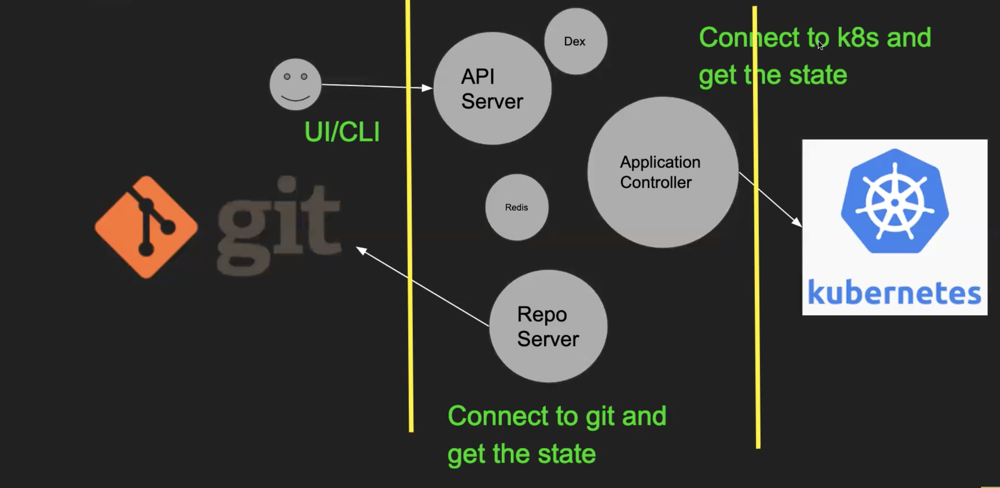

kubectl create namespace argocd
kubectl apply -n argocd -f https://raw.githubusercontent.com/argoproj/argo-cd/stable/manifests/install.yaml

k edit svc argocd-server -n argocd -> to NodePort

minikube service list -n argocd

minikube service argocd-server -n argocd

to login to argocd:

username will be admin

To get the password

copy the password from 

k edit secret argocd-initial-admin-secret -n argocd

echo dTZ2ODhFRmc2ZjBFRTFCOA== | base 64 decode

