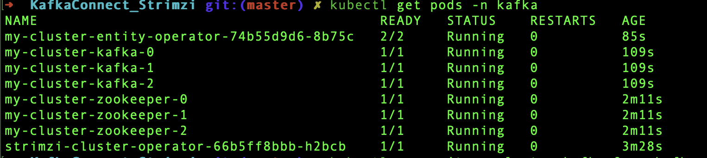

Deploy a Kafka Connect container using Strimzi

Install Strimzi using YAML

kubectl create namespace kafka

kubectl create -f 'https://strimzi.io/install/latest?namespace=kafka' -n kafka

Provision the Kafka cluster:

In this example, we will deploy a Kafka cluster with a single node and ephemeral storage.

Create a new file named kafka.yaml with the following content:

apiVersion: kafka.strimzi.io/v1beta2
kind: Kafka
metadata:
  name: my-cluster
spec:
  kafka:
    version: 3.9.0
    replicas: 3
    listeners:
    - name: plain
      port: 9092
      type: internal
      tls: false
    - name: tls
      port: 9093
      type: internal
      tls: true
    config:
      offsets.topic.replication.factor: 1
      transaction.state.log.replication.factor: 1
      transaction.state.log.min.isr: 1
      default.replication.factor: 1
      min.insync.replicas: 1
      inter.broker.protocol.version: "3.9"
    storage:
      type: ephemeral
  zookeeper:
    replicas: 3
    storage:
      type: ephemeral
  entityOperator:
    topicOperator: {}
    userOperator: {}

And apply the manifest:

kubectl apply -f kafka.yaml -n kafka

Create a new topic
With the Kafka cluster ready, it’s time to create a new topic named samples to publish events to.

apiVersion: kafka.strimzi.io/v1beta2
kind: KafkaTopic
metadata:
  name: samples
  labels:
    strimzi.io/cluster: my-cluster
spec:
  partitions: 1
  replicas: 1
  config:
    retention.ms: 7200000
    segment.bytes: 1073741824

And apply it by running the kubectl command:

kubectl apply -f topic.yaml -n kafka 

NOW , you can login to pod or run kubectl command to SEND and RECEIVE messages

bin/kafka-console-producer.sh --bootstrap-server my-cluster-kafka-bootstrap:9092 --topic samples 

OR

kubectl -n kafka run kafka-producer -ti --image=quay.io/strimzi/kafka:0.45.0-kafka-3.9.0 --rm=true --restart=Never -- bin/kafka-console-producer.sh --bootstrap-server my-cluster-kafka-bootstrap:9092 --topic my-topic

bin/kafka-console-consumer.sh --bootstrap-server my-cluster-kafka-bootstrap:9092 --topic samples --from-beginning
OR
kubectl -n kafka run kafka-consumer -ti --image=quay.io/strimzi/kafka:0.45.0-kafka-3.9.0 --rm=true --restart=Never -- 
bin/kafka-console-consumer.sh --bootstrap-server my-cluster-kafka-bootstrap:9092 --topic my-topic --from-beginning

