Kafka Connect is a component of Apache Kafka that's used to perform streaming integration between Kafka and other systems, such as databases, cloud services, search indices, file systems, and key value stores.

Ingest Data from Upstream Systems Kafka Connect makes it easy to stream data from numerous sources into Kafka and stream data out of Kafka to numerous targets.

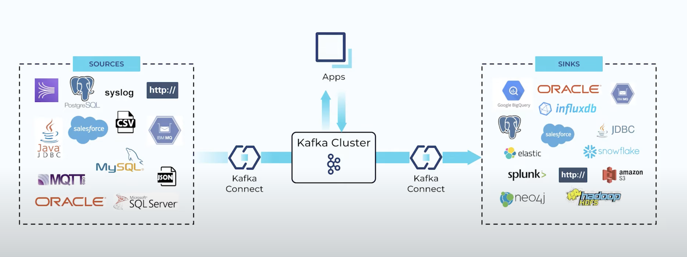

Kafka Connect runs in its own process, separate from the Kafka brokers. It is distributed, scalable, and fault tolerant, giving you the same features you know and love about Kafka itself.

But the best part of Kafka Connect is that using it requires no programming. It’s completely configuration-based, making it available to a wide range of users—not just developers. In addition to ingest and egress of data, Kafka Connect can also perform lightweight transformations on the data as it passes through.

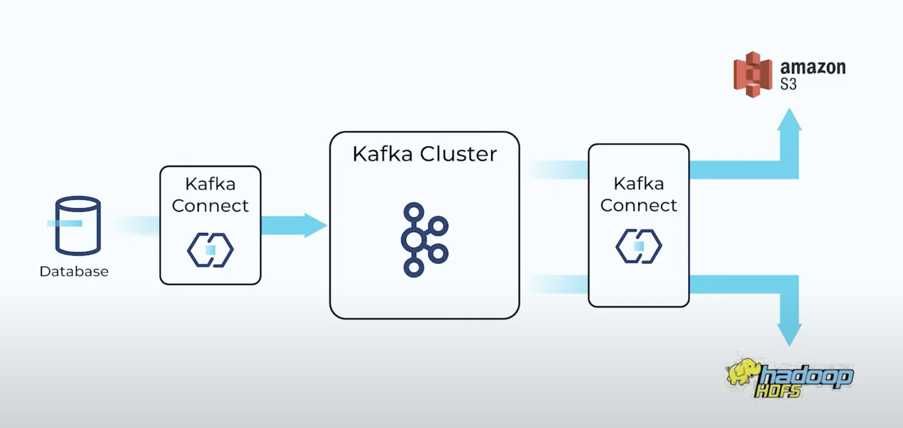

Kafka Connect can be used to ingest real-time streams of events from a data source and stream them to a target system for analytics. In this particular example, our data source is a transactional database.

We have a Kafka connector polling the database for updates and translating the information into real-time events that it produces to Kafka.

but there are several other useful things that we get by adding Kafka to the mix:

1. First of all, having Kafka sits between the source and target systems means that we’re building a loosely coupled system. In other words, it’s relatively easy for us to change the source or target without impacting the other.

2. Additionally, Kafka acts as a buffer for the data, applying back pressure as needed.

3. And also, since we’re using Kafka, we know that the system as a whole is scalable and fault tolerant.

Because Kafka stores data up to a configurable time interval per data entity (topic), it’s possible to stream the same original data to multiple downstream targets. This means that you only need to move data into Kafka once while allowing it to be consumed by a number of different downstream technologies for a variety of business requirements or even to make the same data available to different areas of a business.

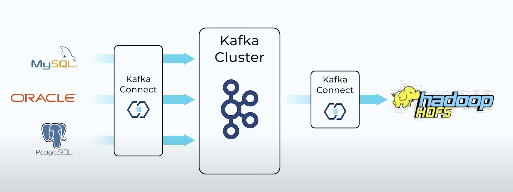

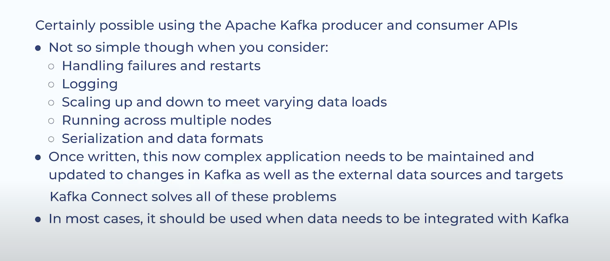

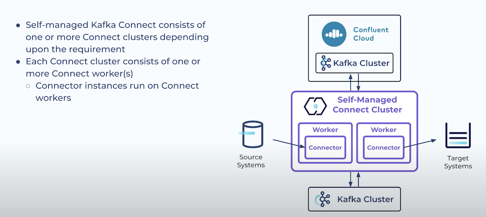

Management responsibilites include

1. Worker configuration
2. Scaling the connect cluster up/down to suit demand changes.
3. monitoring for problems - Troubleshooting, Corrective actions.

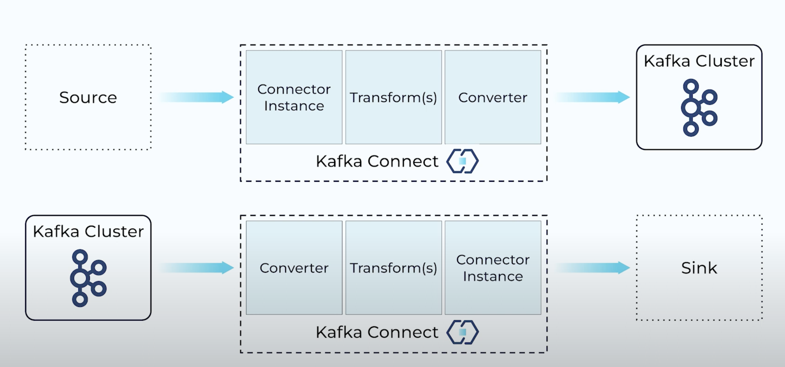

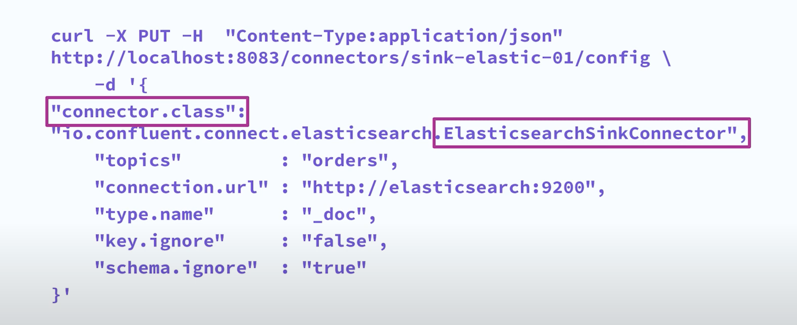

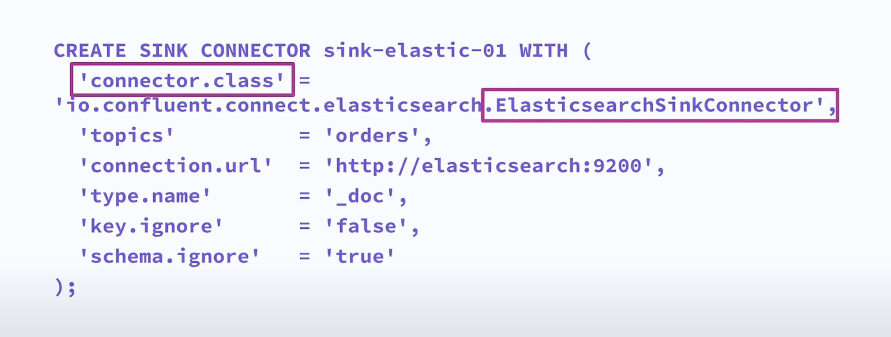

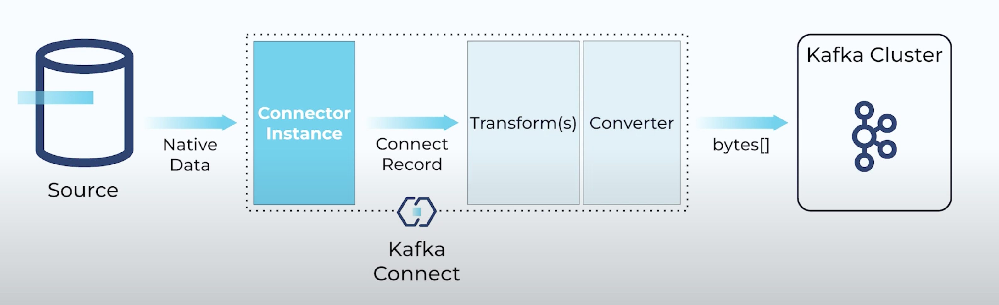

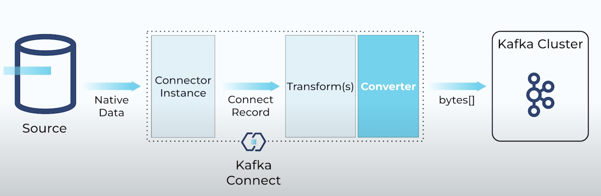

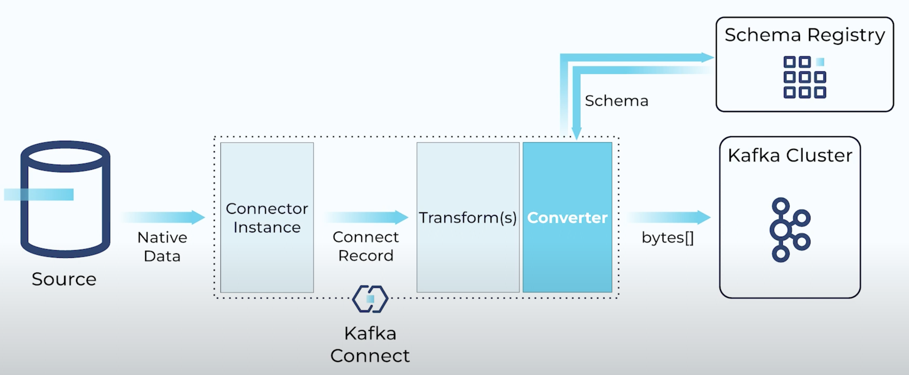

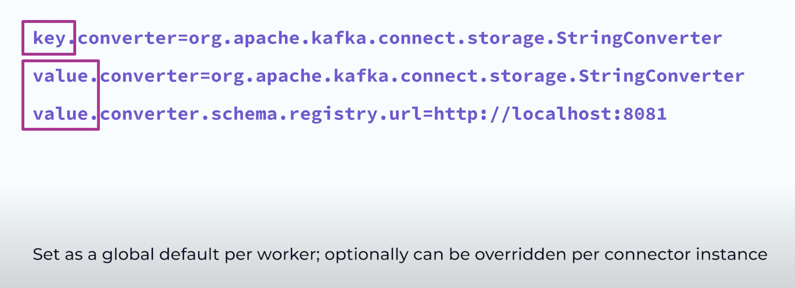

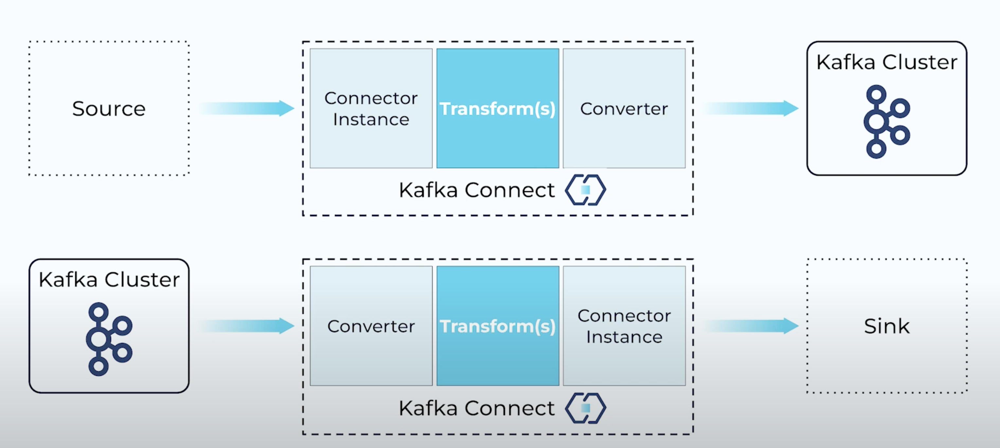

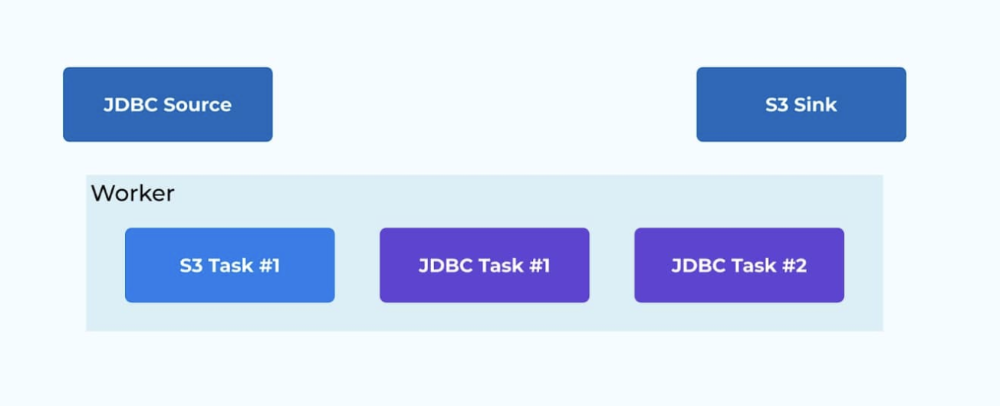

Kafka Connect runs under the Java virtual machine (JVM) as a process known as a worker. Each worker can execute multiple connectors. When you look to see if Kafka Connect is running, or want to look at its log file, it's the worker process that you're looking at. Tasks are executed by Kafka Connect workers.

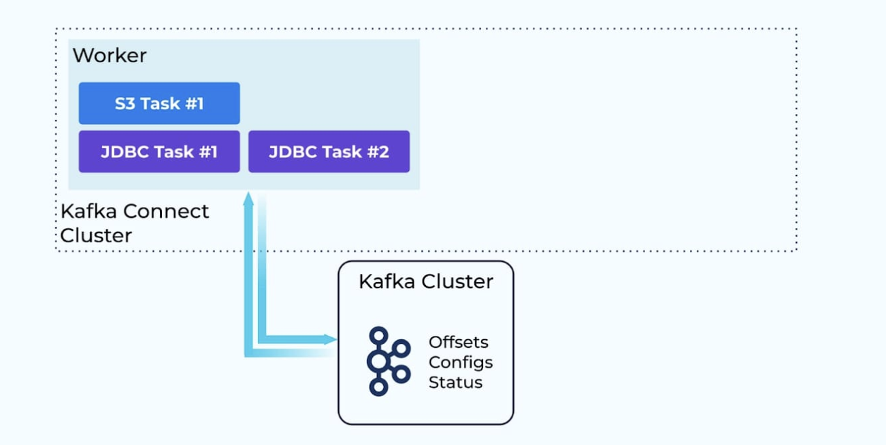

A Kafka Connect worker can be run in one of two deployment modes: standalone or distributed. The way in which you configure and operate Kafka Connect in these two modes is different and each has its pros and cons.

Despite its name, the distributed deployment mode is equally valid for a single worker deployed in a sandbox or development environment. In this mode, Kafka Connect uses Kafka topics to store state pertaining to connector configuration, connector status, and more. The topics are configured to retain this information indefinitely, known as compacted topics. Connector instances are created and managed via the REST API that Kafka Connect offers.

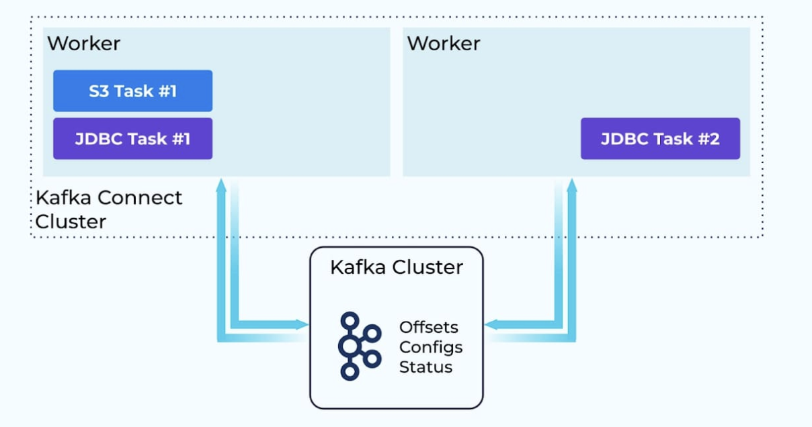

Since all offsets, configs, and status information for the distributed mode cluster is maintained in Kafka topics, this means that you can add additional workers easily, as they can read everything that they need from Kafka. When you add workers from a Kafka Connect cluster, the tasks are rebalanced across the available workers to distribute the workload. If you decide to scale down your cluster (or even if something outside your control happens and a worker crashes), Kafka Connect will rebalance again to ensure that all the connector tasks are still executed.

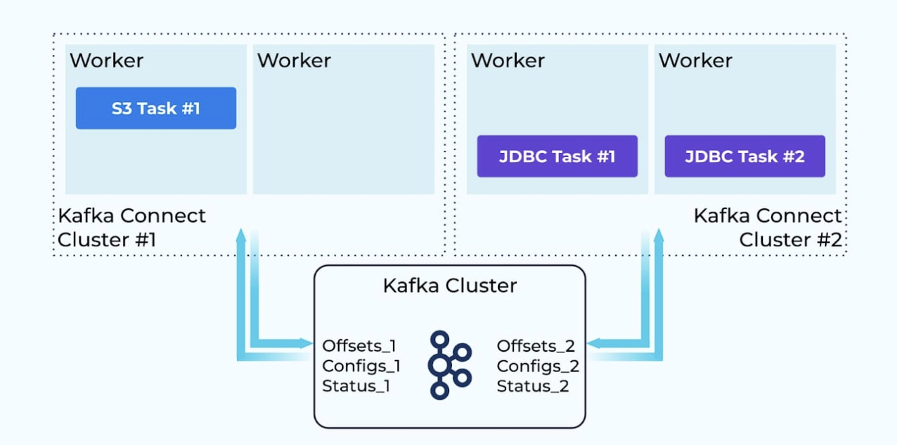

The minimum number of workers recommended is two so that you have fault tolerance. But of course, you can add additional workers to the cluster as your throughput needs increase. You can opt to have fewer, bigger clusters of workers, or you may choose to deploy a greater number of smaller clusters in order to physically isolate workloads. Both are valid approaches and are usually dictated by organizational structure and responsibility for the respective pipelines implemented in Kafka Connect.

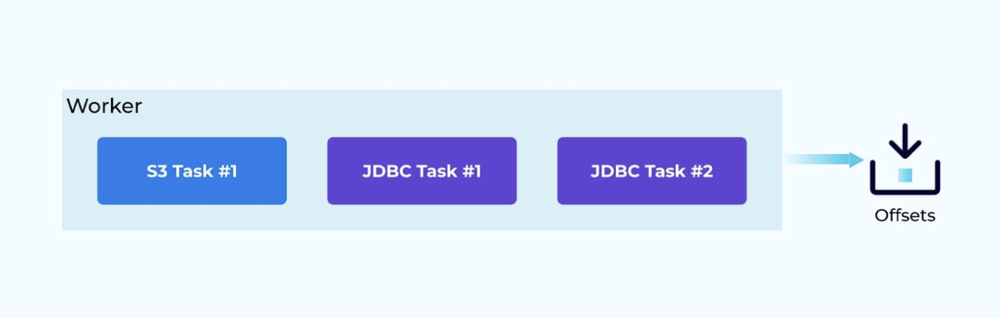

On the other hand, in standalone mode, the Kafka Connect worker uses files to store its state. Connectors are created from local configuration files, not the REST API. Consequently, you cannot cluster workers together, meaning that you cannot scale for throughput or have fault-tolerant behavior.

Because there is just a single worker, you know for certain on which machine a connector’s task will be executing (i.e., the machine on which you’ve deployed the standalone worker). This means that standalone mode is appropriate if you have a connector that needs to execute with server locality, for example, reading from files on a particular machine or ingesting data sent to a network port at a fixed address.

You can satisfy this same requirement using Kafka Connect in the distributed mode with a single worker Connect cluster. This provides the benefit of having offsets, configs, and status information stored in a Kafka topic.